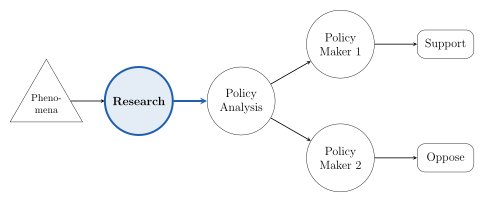

```{=html}

```

I study how evidence reaches policy, and how transparency can build a common understanding of that evidence. My work sits at two points of the chain in the diagram above. At the research node, I measure whether the results economists plan to test ever become public, and I develop standardized formats for reporting them. At the policy analysis node, I developed Open Policy Analysis, a framework that makes the data, code, and assumptions behind a policy estimate open to inspection. Going forward, my main line of research is the standardization of research results, including tools built on large language models that make it affordable at scale. My second line builds new open policy analyses with the same tools.

::: {.text-center}
[<i class="bi bi-file-earmark-pdf"></i> Research Statement](files/research-statement.pdf)
:::

## Job Market Paper

**"Beyond Publication Bias: Characterizing and Understanding Missing Results in Economics"**\
Hoces de la Guardia, F., Miguel, E., Pathan, G., Silva da Rocha, V., Shaji, A., Sørensen, E., Tungodden, B.\
([latest version](files/jmp.pdf), slides [here](https://fhoces.github.io/BITSS-AM-2026-slides/#1), [talk at the BITSS Annual Meeting 2026](https://www.youtube.com/watch?v=JqyH0s2f8TI&t=15s)[, [study results page](file:///Users/fernando/Desktop/sandbox/RGPB_repos/rgpb-phase2-clean-analyse/docs/policy-recs/lessons/index.html)]{.content-visible when-profile="local"}[, study results page coming soon]{.content-hidden when-profile="local"})

We standardized 5,048 pre-registered hypotheses from 317 studies in the AEA RCT Registry and tracked each one to its result.

- 58% have no public result 8 to 9 years after pre-registration, and 64.5% of the reported results are null.
- In an RCT with over 300 research teams, only hands-on engagement with each author's missing hypotheses raised reporting, by 6.2 percentage points. A light-touch message and paid research assistance did not.
- Even with engagement, 42% of hypotheses remained unaccounted for. The paper prototypes standardized Results Reports to close the gap.

::: {.callout-note collapse="true" appearance="simple"}
## Abstract

What scientists choose not to publish can be as important as what they do publish. This study introduces a novel measure of the reporting of research results in economics, and investigates the causes behind under-reporting. Across over 5,048 pre-registered hypotheses from 317 studies on the American Economic Association RCT Trial Registry that were encoded, we first show that only 42% of hypotheses, on average across studies, have publicly available results 8 to 9 years after pre-registration. Around 64.5% of these publicly available findings are null results (i.e., not statistically significant), contrary to widespread concerns about the non-reporting of null results. An RCT was carried out to test three plausible barriers to full reporting, namely, a lack of awareness, engagement, or resources. An intervention in which our team engaged directly with the authors' research and their under-reported findings increased the share of hypotheses with publicly available results by 6.2 percentage points (11% of the missing hypotheses), though most of this increase reflected results that already existed but were buried or previously observed; genuinely new estimates account for only 2.5 percentage points. Authors explained a further 18% of missing hypotheses as cases where the planned research never occurred; these explanations document why a result is absent rather than providing it, and although they do little for publication bias, they help limit research waste by creating a record of which planned studies were never carried out. Neither a light-touch "awareness" intervention nor a more expensive research-assistance intervention added to reporting, indicating that recovery required hands-on engagement. Together, the findings indicate that the majority of pre-registered hypotheses in economics remain unreported, with 42% still unaccounted for even after our most intensive arm; that under-reporting is more complex than a simple reluctance to report nulls; and that recovering missing results is difficult and labor-intensive rather than low-cost. We conclude that there is still need for stronger incentives and infrastructure to ensure that pre-registered scientific plans translate into publicly accessible evidence. Toward that end, this study provides prototypes of how standardized results reporting could be incorporated into economics.
:::

## Published and Working Papers

### Working Papers

::: pub-list
- "Assessing Reproducibility in Economics Using Standardized Crowd-sourced Analysis"; Abel Brodeur ⓡ Seung Yong Sung ⓡ Edward Miguel ⓡ Lars Vilhuber ⓡ Fernando Hoces de la Guardia. [NBER w33753](https://www.nber.org/papers/w33753)
:::

### Published Papers

::: pub-list
- "Reproducibility and robustness of economics and political science research"; Brodeur, A., Mikola, D., Cook, N, Fiala, L. ..., Hoces de la Guardia, F .....; *Nature*, 2026. [DOI](https://doi.org/10.1038/s41586-026-10251-x) [free version](https://researchonline.lse.ac.uk/id/eprint/137919/)
- "Promoting reproducibility and replicability in political science"; Brodeur, A., Esterling, K., Ankel-Peters, J., Bueno, N., Desposato, S., Dreber, A., Genovese, F., Green, D., Hepplewhite, M., Hoces de la Guardia, F., et. al.; *Research & Politics*, 2024. [DOI](https://doi.org/10.1177/20531680241233439)
- "Reproduction and replication at scale"; Brodeur, A., Dreber A., Hoces de la Guardia, F., Miguel, E.; *Nature Human Behaviour*, Correspondence, 2024. [DOI](https://doi.org/10.1038/s41562-023-01807-2)
- "Replication games: how to make reproducibility research more systematic"; Brodeur, A., Dreber A., Hoces de la Guardia, F., Miguel, E.; *Nature*, Comment, 2023. [DOI](https://doi.org/10.1038/d41586-023-02997-5) [free version](https://escholarship.org/uc/item/1qj8937s)
- "A Framework for Open Policy Analysis", F. Hoces De La Guardia, S. Grant, E. Miguel; *Science and Public Policy* 48.2;154-163; 2021. [DOI](https://doi.org/10.1093/scipol/scaa067) [free full text](http://tinyurl.com/1qypbihb)
- "A consensus-based transparency checklist"; Aczel, B., Szaszi, B., Sarafoglou, A., Kekecs, Z., Kucharský, Š., Benjamin, D., ... F. Hoces de la Guardia..., & Ioannidis, J. P; *Nature Human Behaviour*; 2019.1-3. [DOI](https://doi.org/10.1038/s41562-019-0772-6)
:::

### During & Pre-PhD

::: pub-list
- "Loss Function-based Evaluation of Physician Report Cards"; F. Hoces de la Guardia, J. Hwang, JL Adams, SM. Paddock. *Health Services and Outcomes Research Methodology*; 2018. [DOI](https://doi.org/10.1007/s10742-018-0179-2)
- "Optimizing Variance-Bias Trade-off in the TWANG Package for Estimation of Propensity Scores"; L. Parast, D. McCaffrey, L. Burgette, F. Hoces de la Guardia, D. Golinelli, JNV Miles, BA Griffin; *Health Services and Outcomes Research Methodology*; 2017. [DOI](https://doi.org/10.1007/s10742-016-0168-2) [free version](https://pmc.ncbi.nlm.nih.gov/articles/PMC5667923/)
- "Better-than-average and worse-than-average hospitals may not significantly differ from average hospitals: an analysis of Medicare Hospital Compare ratings"; SM Paddock, JL Adams, F. Hoces de la Guardia; *BMJ Quality & Safety*; 2015. [DOI](https://doi.org/10.1136/bmjqs-2014-003405)
- "Evaluating the Chile Solidario Program: Results Using the Chile Solidario Panel and the Administrative Databases", F. Hoces De La Guardia, A. Hojman, O. Larranaga; *Revista Estudios de Economia*, 2011. [DOI](https://doi.org/10.4067/s0718-52862011000100006)
:::
